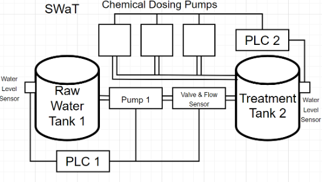
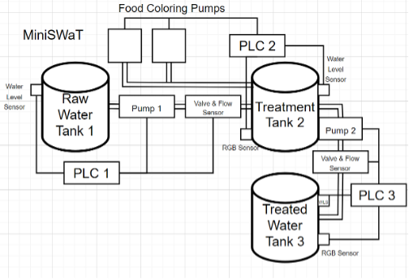

# [Introduction]{.underline}

The MiniWater, a smaller representation of the SWaT system, includes the
first two to three processes of the
[[SWaT]{.underline}](https://itrust.sutd.edu.sg/itrust-labs-home/itrust-labs_swat/).
To provide a cost-effective and open-source alternative to industrial
PLCs, MiniWater integrates Raspberry Pi 4s using OpenPLC. This approach
allows for a low cost mimic of Operation Technology (OT) components such
as PLCs, and information Technology (IT) components, such as the OpenPLC
Runtime Server.

{width="5.537037401574803in"
height="3.1292060367454066in"}

Figure 1: Roughly represents the first three process of the SWaT testbed

{width="5.240740376202974in"
height="3.5610159667541557in"}

Figure 2: Represents the MiniWater testbed

# **[Hardware Setup]{.underline}**

#### Components:

-   [[Raspberry Pi 4
    B]{.underline}](https://www.raspberrypi.com/products/raspberry-pi-4-model-b/)

<!-- -->

-   [[YF-SO2 Water Flow
    Sensor]{.underline}](https://components101.com/sensors/yf-s201-water-flow-measurement-sensor)

-   [[IEIK 116 PSI/110 PSI Diaphragm Water
    Pump]{.underline}](https://a.co/d/6wbfMV6)

-   [[HC-SR04 Range
    Sensor]{.underline}](https://www.handsontec.com/dataspecs/HC-SR04-Ultrasonic.pdf)

-   [[12VDC Doser
    Pumps]{.underline}](https://www.adafruit.com/product/1150)

-   [[12V Solenoid
    Valve]{.underline}](https://www.adafruit.com/product/997?gad_source=1&gclid=CjwKCAjwnei0BhB-EiwAA2xuBqiL45JKLlblB49H7U2vkW-eEJCf5XjGQ_biAIdDWXCo7Cdtozv8rRoCB7AQAvD_BwE)

<!-- -->

-   [[TCS34725 RGB Color
    Senso]{.underline}](https://www.adafruit.com/product/1334)r

-   [[5V Single Channel
    Relay]{.underline}](https://components101.com/switches/5v-single-channel-relay-module-pinout-features-applications-working-datasheet)

-   [[12V 5A Power
    Supply]{.underline}](https://www.amazon.com/dp/B07GFFG1BQ?ref=cm_sw_r_apan_dp_NYKWFZREED7CC7CT9XF0&ref_=cm_sw_r_apan_dp_NYKWFZREED7CC7CT9XF0&social_share=cm_sw_r_apan_dp_NYKWFZREED7CC7CT9XF0&starsLeft=1&skipTwisterOG=2)

#### PLC1 Mappings: 

-   Power:

    -   Pin 2 (5V rail on half-breadboard)

    -   Pin 6 (Ground rail on half-breadboard)

    -   The main half-breadboard supplies a 5V and ground connection for
        PLC1's water pump's relay on another half-breadboard

    -   [[How to use a Relay with Raspberry
        Pi]{.underline}](https://core-electronics.com.au/guides/solenoid-control-with-raspberry-pi-relay/)

        -   Anything that requires a relay will be similar to this link

-   5V YF-S02 Water Flow Sensor:

    -   GPIO 17 (5VDC input signal)

    -   Should change to include a voltage divider to make 3.3V

-   12V IEIK 116 PSI Diaphragm Water Pump:

    -   GPIO 14 (3.3V output signal to a 5V Relay to control the pump's
        12V 5A power supply)

-   5V HC-SR04 Range Sensor

    -   GPIO 15 (Echo - 3.3V input via voltage divider of 1000 ohm, 2000
        ohm)

    -   GPIO 18 (Trigger - 3.3V control pulse)

    -   [[How to connect HC-SR04 Range Sensor with Raspberry
        Pi]{.underline}](https://thepihut.com/blogs/raspberry-pi-tutorials/hc-sr04-ultrasonic-range-sensor-on-the-raspberry-pi)

#### PLC2 Mappings:

-   Power:

    -   Pin 4 (Left 5V rail on full-breadboard of relays)

    -   Pin 6 (Left Ground rail on full-breadboard of relays)

    -   Pin 1 (3.3V Vcc of RGB Color Sensor)

    -   The main half-breadboard right rails are powered by a 12V 0.6A
        power supply to further power 12V components such as Solenoid
        valve and Doser pumps, through the 3 relays' NC.

-   5V HC-SR204:

    -   GPIO 24 (Echo - 3.3V input via voltage divider)

    -   GPIO 23 (Trigger - 3.3V control pulse)

-   12VDC Doser Pumps:

    -   GPIO 20 (Yellow pump - 3.3V control signal to 5V relay)

    -   GPIO 21 (Blue pump - 3.3V control signal to 5V relay)

-   12V Solenoid Valve:

    -   GPIO 16 (3.3V control signal to 5V relay)

-   3.3V TCS34725 RGB Color Sensor:

    -   GPIO 2 (SDA) & GPIO 3 (SCL)

        -   Are the Serial Date Line and Serial Clock Line for the I2C
            protocol used to interface with the RGB Color Sensor's own
            SDA and SCL pins.

    -   [[How to connect TCS34725 RGB Color Sensor to Raspberry
        Pi]{.underline}](https://maker.pro/raspberry-pi/tutorial/how-to-connect-tcs34725-rgb-color-sensor-with-raspberry-pi-zero-w)

#### PLC3 Mappings:

-   Power

    -   Pin 2 (5V rail on full-breadboard)

    -   Pin 6 (Ground rail on full-breadboard)

    -   Pin 1 (3.3V Vcc of RGB Color Sensor)

    -   The main half-breadboard supplies a 5V and ground connection for
        PLC3's water pump's relay on the same half-breadboard as PLC1's
        relay.

<!-- -->

-   5V YF-S02 Water Flow Sensor:

    -   GPIO 4 (5VDC input signal)

-   12V IEIK 100 PSI Diaphragm Water Pump:

    -   GPIO 21 (3.3V control signal to a 5V relay)

-   12V Solenoid Valve:

    -   GPIO 16 (3.3V control signal to a 5V relay)

-   HC-S204 Range Sensor:

    -   GPIO 24 (Echo - 3.3V input via voltage divider)

    -   GPIO 23 (Trigger - 3.3V output pulse)

<!-- -->

-   3.3V TCS34725 RGB Color Sensor:

    -   GPIO 2 (SDA) & GPIO 3 (SCL)

# **[Software]{.underline}**

## [OpenPLC]{.underline}

-   OpenPLC is an open-source software that simulates PLC. It allows the
    creation of automation programs in Industrial Control Systems by
    using microcontrollers or single board computers (SBC) as PLCs.

-   [[OpenPLC documentation for installation and
    overview]{.underline}](https://autonomylogic.com/docs/openplc-overview/)

#### PSM (Python Submodule)

-   OpenPLC's PSM serves as a bridge between the PLC's core logic and
    the physical world, providing low-level access to inputs and
    outputs. It operates as a real-time (best effort) hardware driver to
    provide accurate I/O data to the PLC's logic. The PSM has no
    visibility to the PLC logic and only sees the I/Os.

##### Features:

-   Provides simple direct I/O access function like psm.set_var and
    psm.get_var

-   You can tag/label any variable you want...

##### 

##### Best Practices:

-   **Keep PSM Code Simple:** Focus on effiecent I/O access and avoid
    complex calculations or time-consuming operations

    -   PSM runtime core's scan cycle of 20ms limit

-   **Consider External Libraries:** For advanced hardware interactions
    (e.g. RGB sensor) or data processing (e.g. calculating distance),
    explore using external Python libraries within the PSM.

## Instructions for setting up water treatment simulator (Digital Twin)
1.  Setup OpenPLC Runtime on any local device (could be a Linux VM, Windows, etc.)
    a.  Follow the instructions here depending on what target OS you are using:  https://github.com/thiagoralves/OpenPLC_v3
2.  Once your PLC runtime is running, go to the webserver (should be just http://<ipaddress>:8080
    a.  Where <ipaddress> is replaced with the IP address of your runtime 
    b.  Login with “openplc” for both username and password
3.  Go to the “Programs” tab in the Dashboard
    a.  Unzip the files from plc2sim.zip and look for the “generated_plc2.st” file
    b.  Upload the program and name it whatever you’d like
    c.  On the bottom left, click “Start PLC”
4.  Observe the monitoring values in “Monitoring” tab
5.  Run the simulator script to generate values for your PLC
6.  You should be able to modify the trace generation scripts for the simulator
